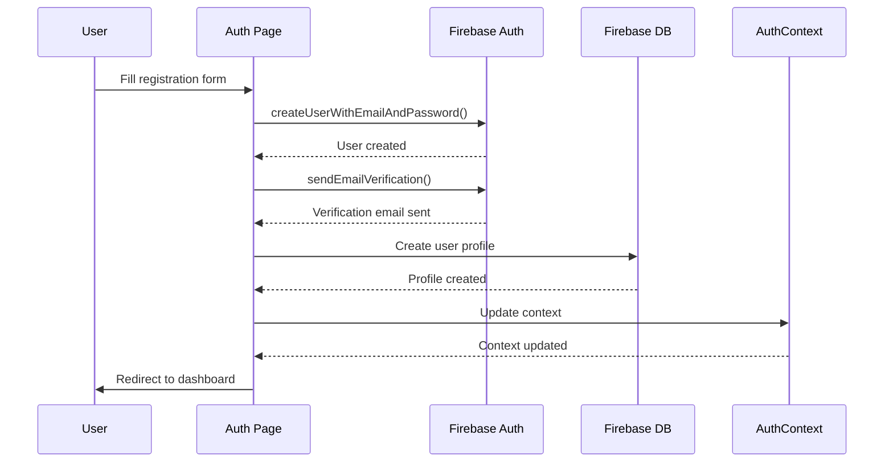
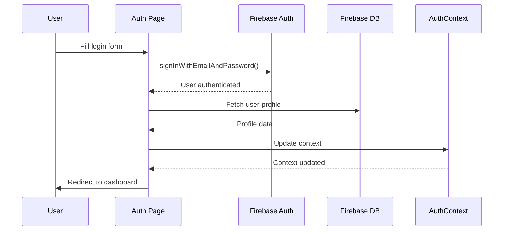
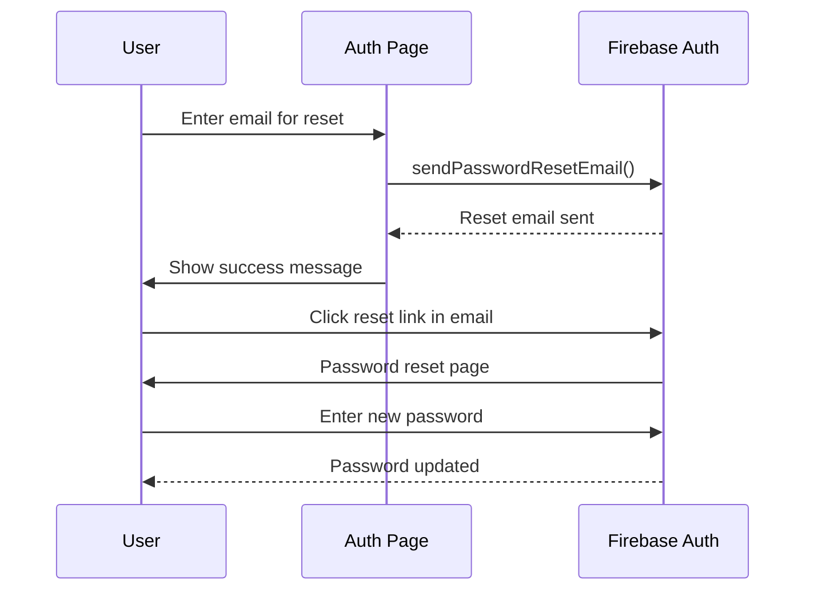
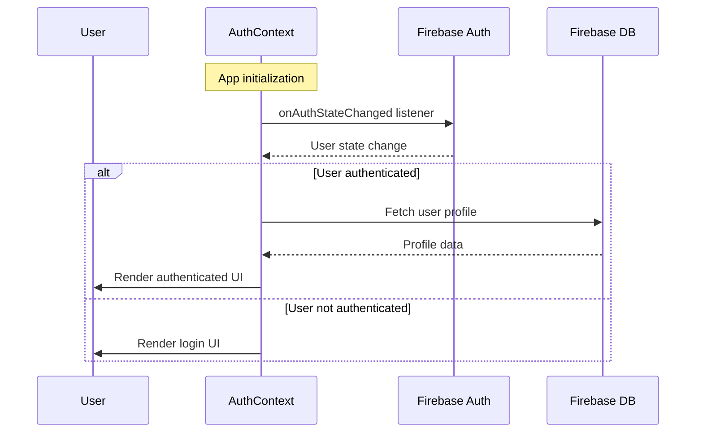

# Authentication Flow

This document describes the user authentication and authorization system in BYAMN WorkHub.

## Overview

The application uses Firebase Authentication for user management with email/password authentication. The authentication state is managed globally using React Context API.

## Authentication Components

### AuthContext Provider

The `AuthContext` provides authentication state and methods throughout the application:

```typescript
interface AuthContextType {
  user: User | null;              // Firebase Auth user object
  profile: UserProfile | null;    // Extended user profile from database
  loading: boolean;               // Authentication loading state
  signUp: (email: string, password: string, fullName: string) => Promise<void>;
  signIn: (email: string, password: string) => Promise<void>;
  logout: () => Promise<void>;
  resetPassword: (email: string) => Promise<void>;
  updateProfile: (data: Partial<UserProfile>) => Promise<void>;
  refreshProfile: () => Promise<void>;
}
```

### ProtectedRoute Component

Routes that require authentication are wrapped with `ProtectedRoute`:

```typescript
interface ProtectedRouteProps {
  children: React.ReactNode;
  requireAdmin?: boolean;         // Requires admin role
}
```

## Authentication Flow

### 1. User Registration



**Key Steps:**
1. Validate form data using Zod schema
2. Create Firebase Auth user
3. Send email verification
4. Create user profile in database
5. Initialize user wallet
6. Update AuthContext and redirect

### 2. User Login



**Key Steps:**
1. Validate email/password
2. Authenticate with Firebase
3. Fetch user profile from database
4. Update AuthContext
5. Redirect to dashboard

### 3. Password Reset



### 4. Session Management



## Route Protection

### Public Routes
- `/` - Landing page
- `/auth` - Login/Register
- `/about` - About page
- `/privacy` - Privacy policy
- `/terms` - Terms of service

### Protected Routes
- `/dashboard` - User dashboard
- `/campaigns/create` - Create campaign
- `/wallet` - Wallet management
- `/profile` - User profile
- `/profile/edit` - Edit profile
- `/my-work` - User's work
- `/admin` - Admin panel (admin only)

### Route Implementation

```typescript
// App.tsx
<Routes>
  <Route path="/" element={<Landing />} />
  <Route path="/auth" element={<Auth />} />

  {/* Protected Routes */}
  <Route path="/dashboard" element={
    <ProtectedRoute>
      <Dashboard />
    </ProtectedRoute>
  } />

  {/* Admin Only Route */}
  <Route path="/admin" element={
    <ProtectedRoute requireAdmin={true}>
      <AdminDashboard />
    </ProtectedRoute>
  } />
</Routes>
```

## User Roles & Permissions

### User Roles

```typescript
type UserRole = 'user' | 'admin';
```

### Role-Based Access Control

```typescript
// ProtectedRoute.tsx
const ProtectedRoute: React.FC<ProtectedRouteProps> = ({
  children,
  requireAdmin = false
}) => {
  const { user, profile, loading } = useAuth();

  if (loading) {
    return <LoadingSpinner />;
  }

  if (!user) {
    return <Navigate to="/auth" replace />;
  }

  if (requireAdmin && profile?.role !== 'admin') {
    return <Navigate to="/dashboard" replace />;
  }

  return <>{children}</>;
};
```

### Admin Permissions

Admins have access to:
- Admin dashboard (`/admin`)
- User management capabilities
- Campaign moderation
- Work approval/rejection
- System analytics

## Security Considerations

### Firebase Security Rules

```javascript
{
  "rules": {
    "users": {
      "$uid": {
        ".read": "auth != null && auth.uid == $uid",
        ".write": "auth != null && auth.uid == $uid"
      }
    },
    "campaigns": {
      ".read": "auth != null",
      ".write": "auth != null"
    },
    "works": {
      "$userId": {
        ".read": "auth != null && (auth.uid == $userId || auth.token.admin == true)",
        ".write": "auth != null && auth.uid == $userId"
      }
    }
  }
}
```

### Client-Side Security

1. **Input Validation**: All forms use Zod schemas for validation
2. **Error Handling**: Comprehensive error handling for auth operations
3. **Secure Storage**: Sensitive data stored securely in Firebase
4. **Route Protection**: Client-side route guards prevent unauthorized access

### Authentication Errors

Common error codes and handling:

```typescript
const handleAuthError = (error: AuthError) => {
  switch (error.code) {
    case 'auth/user-not-found':
      return 'No account found with this email';
    case 'auth/wrong-password':
      return 'Incorrect password';
    case 'auth/email-already-in-use':
      return 'Account already exists with this email';
    case 'auth/weak-password':
      return 'Password is too weak';
    case 'auth/invalid-email':
      return 'Invalid email address';
    default:
      return 'Authentication failed';
  }
};
```

## User Profile Management

### Profile Updates

```typescript
// Update user profile
const updateProfile = async (data: Partial<UserProfile>) => {
  if (!user) return;

  await update(ref(database, `users/${user.uid}`), data);
  await fetchProfile(user.uid); // Refresh profile data
};
```

### Profile Data Flow

1. User edits profile in UI
2. Form validation using Zod
3. Update database record
4. Refresh AuthContext profile data
5. UI updates with new data

## Session Persistence

Firebase Auth automatically persists authentication state:

- **Local Storage**: Used for web applications
- **Session Storage**: Can be configured for session-only persistence
- **IndexedDB**: Used internally by Firebase

## Logout Process

```typescript
const logout = async () => {
  await signOut(auth);
  // AuthContext automatically clears user/profile state
  navigate('/');
};
```

## Testing Authentication

### Unit Tests

```typescript
describe('AuthContext', () => {
  it('should sign in user successfully', async () => {
    // Mock Firebase auth
    // Test sign in flow
  });

  it('should handle auth errors', async () => {
    // Test error scenarios
  });
});
```

### Integration Tests

```typescript
describe('Authentication Flow', () => {
  it('should redirect unauthenticated users', () => {
    // Test protected route behavior
  });

  it('should allow authenticated users', () => {
    // Test authenticated access
  });
});
```

## Monitoring & Analytics

### Authentication Events

Track authentication events for analytics:

- User registration
- Login attempts (success/failure)
- Password resets
- Profile updates
- Account deletions

### Security Monitoring

Monitor for suspicious activity:

- Multiple failed login attempts
- Unusual login locations
- Password reset abuse
- Account lockouts
